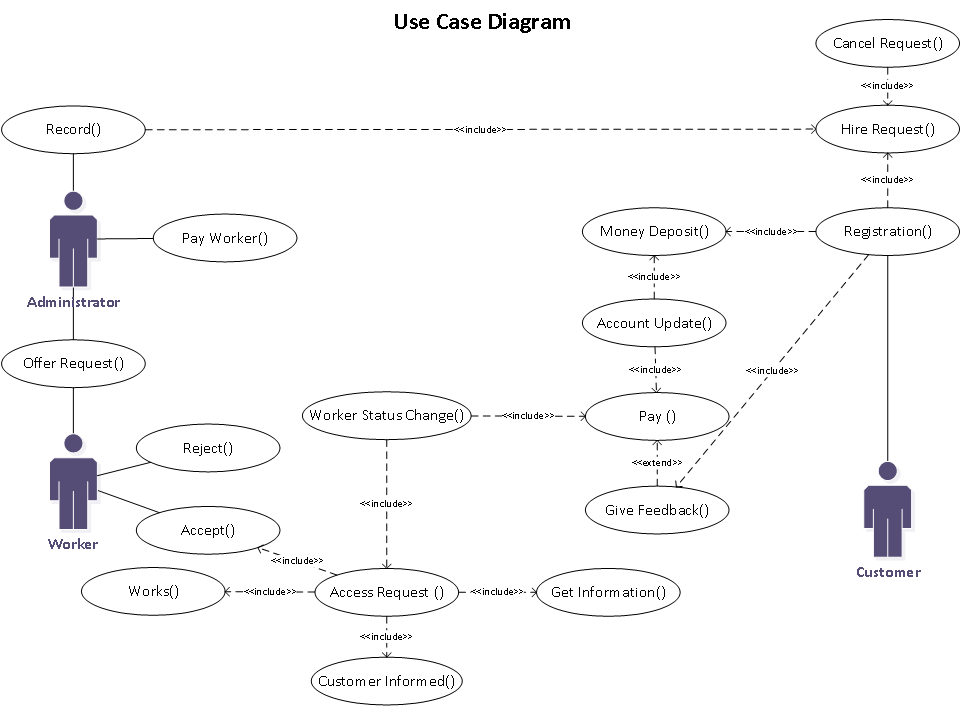

# Haazir App

### Service Providing App
> - By 
>   - **B19102104 Muhammad Umar Anzar**
>   - **B19102068 Muhammad Anas Rashid**
>   - **B19102010 Ahmed Haseeb**
> - University Of Karachi 
> - UBIT department of computer science
> - Subject Object Oriented Programming

## Description
<!--Description of program-->
This is an OOP base project which is implemented for providing ease of hiring daily life services such as plumbers, electricians, etc. This project basically takes the idea of ride-hailing services like Careem and Uber and transforms it into a service-providing system so that people can hire these services from the comfort of their homes instead of searching various places to find these workers.

## Problem Statement
<!--Problem Statement of program-->
As we already know that masses are becoming civilized, getting accustomed to everyday technology. Science and Economics are pushing us to beyond our imagination, but interim people are forgetting basic household maintenance skills such as, 
- Fixing House Drainage Pipes
- Fixing Basic Electrical Appliances
- Fixing Air Conditioners
- House Renovation 
- Vehicle Maintenance

### Objectives

For all these problems we introduce one stop solution HAAZIR, an all-in-one service providing application.
HAAZIR provides solution for all these kinds of hectic time-consuming tasks with some distinguish features such as, 
- Transparent dealing between Client and HAAZIR
- Certified Technicians 
- Completion on Time
- Security (as you are our first priority) and Privacy protection

### Scope

As we are examining scope of HAAZIR someone somewhere is always there seeking for some genuine help for issues related to their House, Vehicle or any Mechanical or Technical Support.
Demand: Rising  
Reasons:
- Nuclear Families 
- Intense working condition (in some cases)
- Require Hands on Practice
- Laborious 
- Sequential Damage (if treated by an unskilled person) 

## Use Case Diagram

 <!--Usecase-->

## Animations
<!--Description of animation-->
As we all know java swing is an old framework and there is no concept of built-in animation in it. So using multi threading concept, we created animations by overriding `run()` method, having a loop inside it and use of `thread.sleep()` to change opactiy gradually and at some places changing the size of **Jpanels** or moving them left and right to add animation in our ui.

<h4 align="center">Main Introduction
</h4>

 <!--Intro animation-->

 

<h4 align="center">Horizontal Sliding login and Signup
</h4>

<!--signup/register animation-->

 

<h4 align="center">Setting Panel
</h4>

 <!--menu slider animation-->

